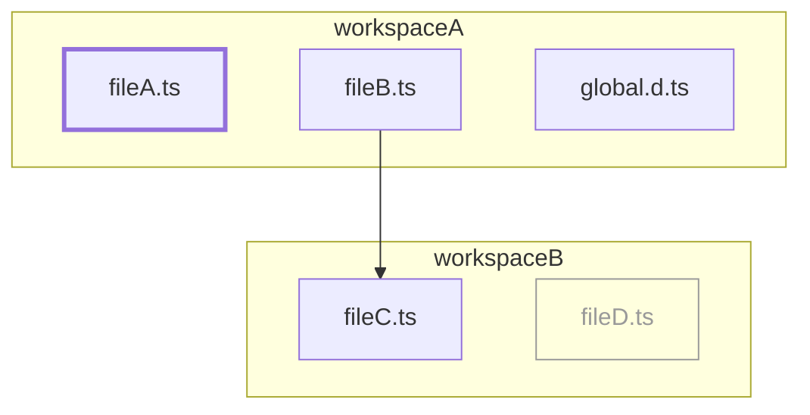
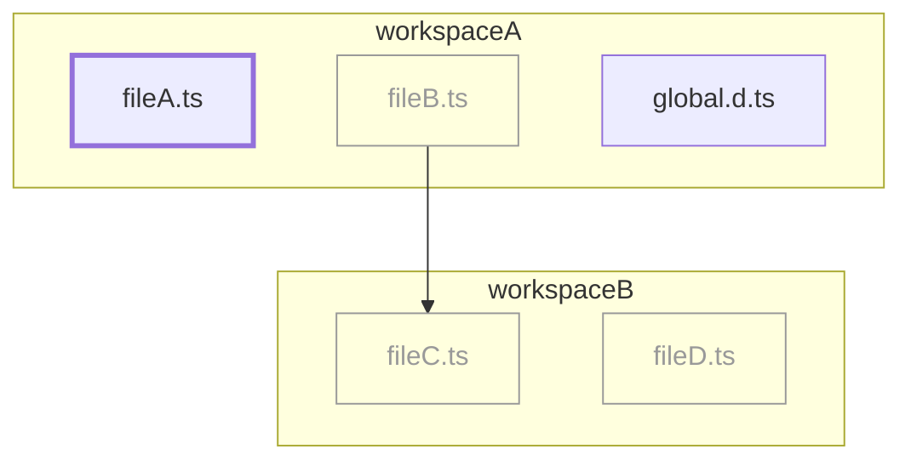

<p align="center">
	
</p>

# ts-scope-trimmer-plugin

A TypeScript server plugin that limits the scope of tsserver to speed up the experience in code editors by processing only the open files and their dependencies.

## Motivation

Poor TypeScript performance in code editors and high memory usage is a common issue in large codebases, especially in monorepos. To mitigate this, the community has been tweaking configs, refactoring code and waiting for [TypeScript 7](https://devblogs.microsoft.com/typescript/typescript-native-port/). But what if we could get a visible performance boost by changing the way tsserver treats projects? Let’s take a look at the project example and see what happens after opening a single file.
```
workspaceA
  - global.d.ts
  - fileA.ts
  - fileB.ts
  - tsconfig.json

workspaceB
  - fileC.ts
  - fileD.ts
  - tsconfig.json
```

`workspaceA/tsconfig.json` is the following:

```
"compilerOptions" {
  ...
},
"include": ["."]
```
After opening `workspaceA/fileA.ts`, tsserver processes and adds watchers for *all files* in workspaceA and their dependencies, so 4 files in total:



To illustrate the problem, here is a [simple file](https://github.com/voronin-ivan/large-monorepo/blob/c7bcab106ef76277739b6eebdfa30739fa549e56/apps/crew/pages/index.tsx) without any TS dependencies: loading it in VSCode takes >5s because tsserver processes 6510 files. `ts-scope-trimmer-plugin` changes this behavior by limiting the tsserver scope only to the open files, their dependencies and global types:



So opening the [same file](https://github.com/voronin-ivan/large-monorepo/blob/c7bcab106ef76277739b6eebdfa30739fa549e56/apps/crew/pages/index.tsx) in VSCode takes around 500ms because tsserver loads only 183 files.

> [!WARNING]  
> Features like "find all references" and "find usages" are not fully functional since they need the full project context. This seems like an acceptable trade-off, considering the opt-in nature of the plugin. See [configuration](#configuration) for more details.

## Usage

### Installation

Add this plugin as a dev dependency to your project:

```bash
npm install ts-scope-trimmer-plugin --save-dev
```

And then add this plugin to your `tsconfig.json`:

```json
{
  "compilerOptions": {
    "plugins": [
      {
        "name": "ts-scope-trimmer-plugin"
      }
    ]
  }
}
```

### Configuration

| Option          | Type     | Default | Description                        |
| --------------- | -------- | ------- | ---------------------------------- |
| `enabled`       | boolean  | `false` | Enable/disable the plugin          |
| `alwaysInclude` | string[] | `[]`    | Glob patterns for files that should always be included, e.g. global types. Relative to the project root. |
| `debug`         | boolean  | `false` | Enable/disable debug logging       |

These options can be specified in `tsconfig.json` or in `ts-scope-trimmer.json` in your project root. The latter has higher priority and can be added to `.gitignore`, so engineers can toggle the plugin locally on demand.

### Requirements

This plugin is tested with TypeScript >=5.0.0, Node.js >=18.0.0 and the following code editors:

- VSCode
- Cursor
- IntelliJ IDEA
- WebStorm
- Neovim
- Zed

## Contributing

Contributions are welcome! Please see [CONTRIBUTING.md](CONTRIBUTING.md) for details.
